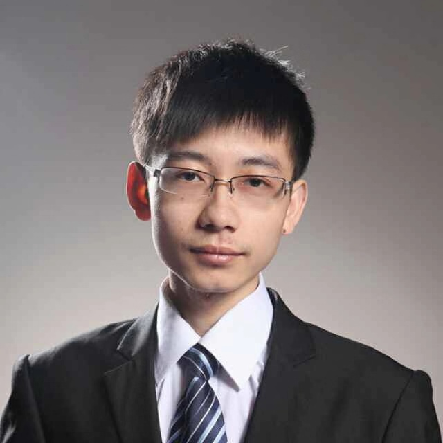

## About Me

- I was born in Nanchang, China in 1994. I am currently working in Alibaba DAMO Academy. I received my B.S. and Ph.D. degree from Zhejiang University, under the supervision of Prof. [Wei Jiang](https://person.zju.edu.cn/jiangwei), in 2015 and 2020, respectively. 

- If you are applying for a Research Intern or a PhD student in computer vision, you also can contact me. I co-supervise PhD students with Prof. Wei Jiang at Zhejiang University.

- You can find my publications on [Google Scholar](https://scholar.google.com.hk/citations?user=7QvWnzMAAAAJ&hl=zh-CN) and my open source code on [GitHub](https://github.com/michuanhaohao).

## Research Interest

- Self-supervised learning
- Vision Transformer
- Person/Vehicle Re-identification
- Deep Learning 
- Computer Vision

## News
- One paper was accepted by AAAI2021. [[pdf]](https://arxiv.org/pdf/2109.03810)
- TransReID has been accepted by ICCV2021.
    [[code]](https://github.com/damo-cv/TransReID)
    [[pdf]](https://openaccess.thecvf.com/content/ICCV2021/papers/He_TransReID_Transformer-Based_Object_Re-Identification_ICCV_2021_paper.pdf)
- We won the 1st place in Track2 and Track3 in the 5th AICITY Challenge, CVPR2021.
    [[code]](https://github.com/michuanhaohao/AICITY2021_Track2_DMT)
	[[pdf]](https://openaccess.thecvf.com/content/CVPR2021W/AICity/papers/Luo_An_Empirical_Study_of_Vehicle_Re-Identification_on_the_AI_City_CVPRW_2021_paper.pdf)
- We won the 1st place in [ECCV VISDA2020 Challenge](http://ai.bu.edu/visda-2020/).
    [[code]](https://github.com/vimar-gu/Bias-Eliminate-DA-ReID)
	[[pdf]](https://arxiv.org/pdf/2012.13498.pdf)
- We won the 1st place in [2020 iQIYI iCartoonFace Challenge, IJCAI-PRICAI 2020 Grand Challenge](http://challenge.ai.iqiyi.com/detail?raceId=5def71b4e9fcf68aef76a75e).
- We won the 3rd place in AICity Challenge 2020, CVPR Workshop.
    [[pdf]](https://arxiv.org/pdf/2004.10547.pdf)
    [[code]](https://github.com/heshuting555/AICITY2020_DMT_VehicleReID)
- We won the 2nd price (300,000¥ Bonus) again in NAIC2020 ReID Challenge. 
- We won the 2nd price (500,000¥ Bonus) in NAIC2019 ReID Challenge. [[code]](https://github.com/heshuting555/NAIC_Person_ReID_DMT)
- Our Strong Baseline has been accepted by IEEE Transactions on Multimedia (TMM).  
    [[pdf]](https://ieeexplore.ieee.org/document/8930088)
    [[arxiv]](https://arxiv.org/pdf/1906.08332)
    [[code]](https://github.com/michuanhaohao/reid-strong-baseline)
- STNReID has been accepted by IEEE Transactions on Multimedia (TMM).  
    [[pdf]](https://ieeexplore.ieee.org/abstract/document/8955948)
    [[arxiv]](https://arxiv.org/abs/1903.07072) 
- AlignedReID++ has been accepted by Pattern Recognition (PR).  
    [[pdf]](https://www.sciencedirect.com/science/article/pii/S0031320319302031?via%3Dihub#!)
    [[code]](https://github.com/michuanhaohao/AlignedReID)
- I will make an oral presentation to the TRMTMCT2019 Workshop of CVPR2019.
    [[pdf]](http://openaccess.thecvf.com/content_CVPRW_2019/papers/TRMTMCT/Luo_Bag_of_Tricks_and_a_Strong_Baseline_for_Deep_Person_CVPRW_2019_paper.pdf)
    [[code]](https://github.com/michuanhaohao/reid-strong-baseline)
- SphereReID to appear at Computer Vision and Image Understanding.[[pdf]](https://arxiv.org/pdf/1807.00537)
- SCPNet to appear at ACCV2018.[[pdf]](https://arxiv.org/pdf/1810.06996)
     [[code]](https://github.com/xfanplus/Open-SCPNet)
- We have released the code of AlignedReID.[[pdf]](https://arxiv.org/pdf/1711.08184)
     [[code]](https://github.com/michuanhaohao/AlignedReID)

## Academic Service

Conference PC/Reviewer: ICCV,CVPR,ECCV,AAAI,ICME,ICLR

Journal Reviewer: TIP,TMM,Neurocomputing,NEUNET

## Awards and Honors
- **First Place**, AICITY Challenge, CVPR2021
- **First Place**, VISDA2020 Challenge, ECCV2020
- **First Place**, 2020 iQIYI iCartoonFace Challenge, IJCAI-PRICAI 2020
- **Third Place**, AICity Challenge 2020, CVPR2020 Workshops
- **Second Price (300,000¥ Bonus)**, ReID Challenge, NAIC2020
- **Second Price (500,000¥ Bonus)**, ReID Challenge, NAIC2019
- **China National Scholarship**, P.R.China
- **HuaWei Scholarship**
- **Outstanding Graduates**, Zhejiang Province, China
- **Chunhui Award (Blue Ribbon)**,College of CSE, Zhejiang University
- **Outstanding Student Leaders**, Zhejiang University
- **Merit Student**,Zhejiang University
- **Excellent Student Awards**, Zhejiang University
- **First Prize in Advanced Mathematics Competition**, Zhejiang Province, China

## Leadership Activities

- **Founder & President**, _Student AI Association of Zhejiang University_, Dec 2017 ~ May 2019
- **President**, _Student union of College of CSE, Zhejiang University_, July 2013 ~ Jun 2014
